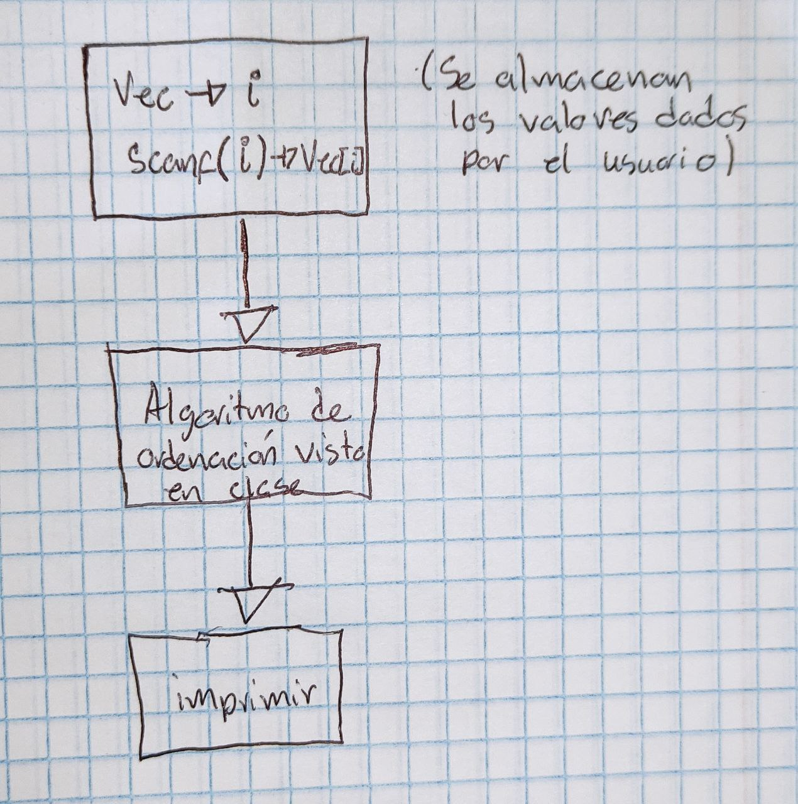

# Laboratorio 4
Se realizo el laboratorio 4, este archivo se puede encontrar en el siguiente [link](https://classroom.google.com/u/0/c/MjI3NzAwMDY2ODg3/a/NTA1NjIxODE3OTc4/details).
-------------
-------------

## Problema 1
Debe de ingresar un vector de 10 elementos, llenarlo de numeros pares del 2 al 20. Al iniciar el programa debe preguntar al usuario como quiere ver los numeros, el menu debe de ser por medio de  caracteres: “a” verlos de forma ascendente, “d” descendente, en caso que el usuario escriba otro valor debe de decir que no es correcto y preguntarle el caracter nuevamente, hasta que este sea el correcto, al ingresar el valor correcto muestra el vector en pantalla y termina el programa.


### Metodologia:
1. Se crea el vector desordenado.

2. Se pregunta el orden deseado (en mi caso no lofre hacerlo con caracteres aso que es por numeros). 

3. Se verifica la opcion elegida y se procede a hacer el ordenamiento. 

4. Se mustra el resultado.

El código se puede ver en este [documento](Problema1.c).

---


### Variables:

<div align="center">

|<div align="center">Variable</div>|<div align="center">Uso / Explicación</div>|
|---|---|
|<div align="center">data</div>|<div align="center">Es el vector con los valore3s pares desordenados</div>|
|<div align="center">val</div>|<div align="center">Es una variable que uso como validación</div>|


</div>

### Diagrama de Flujo/Pseudo-código:


```c
while(Bucle para las opciones)

Print("opcion")             #Sera la forma de orden que desea

If de verificacion          #Sera para verificar la opcion elegida

if==opccion 1;
Ordenacion ascendente;      #Ordeno de menor a mayor

if==opccion 2;
Ordenacion descendente;     #Ordeno de mayor a menor

salgo del bucle
```

-------------
-------------
## Problema 2
Crear un programa que solicite al usuario 5 numeros enteros, estos se deben de guardar en un vector, al terminar de guardar los valores, el programa debe de ordenarlos de forma ascendente y mostrar el vector ordenado. (utilice un metodo de ordenacion.)


### Metodologia:
1. Se solicitan los valores y se almacenan en un vector.

2. Se ejecuta el mismo algoritmo de ordenacion que el problema 1. 

3. Se imprime el resultado. 


El código se puede ver en este [documento](Problema2.c).

---


### Variables:

<div align="center">

|<div align="center">Variable</div>|<div align="center">Uso / Explicación</div>|
|---|---|
|<div align="center">data</div>|<div align="center">Es el vector con los valore3s pares desordenados</div>|


</div>

### Diagrama de Flujo/Pseudo-código:



-------------
-------------


## Problema 3
Crear un programa que solicite al usuario dos posiciones en coordenadas (x,y,z) al obtenerlas debe de almacenarlas en dos vectores, el programa automaticamente debe de mostrar los siguientes resultados:
1. magnitud del vector.
2. suma de vectores.
3. producto escalar.
4. producto vectorial.
 


### Metodologia:
1. Se solicitan los valores y se almacenan en 2 vectores.

2. Se hacen las funciones y el codigo para cada operacion. 

3. Se imprime los resultados. 


El código se puede ver en este [documento](Problema3.c).

---


### Variables:

<div align="center">

|<div align="center">Variable</div>|<div align="center">Uso / Explicación</div>|
|---|---|
|<div align="center">vec1</div>|<div align="center">Es donde se almacenan los datos del primer vector</div>|
|<div align="center">vec2</div>|<div align="center">Es donde se almacenan los datos del segundo vector</div>|
|<div align="center">res</div>|<div align="center">Es el vector dende se guardaran los resultados.</div>|


</div>

### Diagrama de Flujo/Pseudo-código:

```c
scanf(vector1);
scanf(vector2);

printf(mag(vec1));
printf(mag(vec2));          #Se usa una funcion para magnitudes

for(i=0, i<3)
for(j=0, j<3)
res[i][j]=vec1[i][j]+vec2[i][j]
                            #SE hacen las sumas con fors anidados

Funcion para el producto escalar;

Funcion para el producto vectorial;

float mag(float vec[3])
{
    
    float res = 0, aux1=0;
    //Es el argumento que tiene el valor de la raiz
    aux1=vec[0]*vec[0]+vec[1]*vec[1]+vec[2]*vec[2];
    //Calculo la magnitud
    res = sqrt(aux1);
    return res;
}               
                        #funcion de magnitud
```

-----

