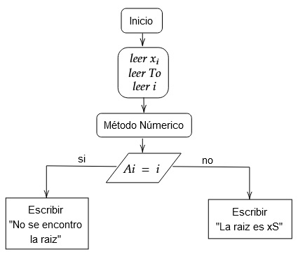

# Segundo Parcial
Se realizo el Segundo Parcial, los qjercicios para carnets con terminación 9. Este archivo se puede encontrar en el siguiente [link](https://classroom.google.com/u/0/c/MjI3NzAwMDY2ODg3/a/NTA1NjIxODE4NjIy/details).
-------------
-------------

## Inciso 1


### Metodologia:
1. Se creo un archivo donde con los datos tabulados y ordenados por columnas esto se puede ver en el archivo [datos](datos).

2. Se procede a hacer el documento .gp para graficar los que se solicita, se prentende tener 3 graficas mas o menos, para que se vean los avances de cada bloque de código. El psudocódigo se pensó como se ve en la sección de Diagráma de Flujo/Pseudo-código. 

3. Se compila (Si esta usando WSL) el proceso se tarda bastante. 

4. Ve sen los resultados del [fit](fit.log), para ver los valores de a y b.

5. Se genera el código para hacer el despeje y y calcular el valor de x (el tiempo en semanas).

6. Se hacen todas las graficas juntas.


El código se puede ver en este [documento](Precio_del_Combustible.gp).

---


### Variables:

<div align="center">

|<div align="center">Variable</div>|<div align="center">Uso / Explicación</div>|
|---|---|
|<div align="center">a</div>|<div align="center">Se toma el valor dado en el archivo [fit](fit.log). Este es el valor que se obtiene al hacer el ajuste lineal</div>|
|<div align="center">b</div>|<div align="center">Se toma el valor dado en el archivo [fit](fit.log). Este es el valor que se obtiene al hacer el ajuste lineal</div>|
|<div align="center">aux1</div>|<div align="center">Se usa para almacenar valores en el despeje de la ecuación que se hace en este [documento](Precio_del_Combustible.c).</div>|
|<div align="center">aux2</div>|<div align="center">Se usa para almacenar valores en el despeje de la ecuación que se hace en este [documento](Precio_del_Combustible.c).</div>|

</div>

### Diagrama de Flujo/Pseudo-código:


```gnuplot
plot gráfica_1              #Esto serán los datos de la tabla

f(x)=a*x+b                  #defino la ecuacion de la recta

fit -> datos -> f(x)        #Hago un fit de los datos usando la ecuacion de la recata

plot gráfica_2              #grafico los datos y el ajuste lineal

plot gráfica_3              #Se agrega el valor de 30 para ver la intesección.

doc.c                       #Este programa calcula la coordenada x de la intersección.

plot gráfica_4              #Se agregan las coordenadas de la intersección
```

-----

## Inciso 2

### Metodologia:
1. Despues de ver el método númerico, se decide separar en tres "bloques" o "partes" la programación, para después unirlas. Esto se puede ver en este [archivo](Newton_Raphson.c).

2. Se procede a hacer el diagrama de flujo Diagráma de Flujo/Pseudo-código. 

3. Se programan las funciones del diagrama de flujo, el resultado se ve en este [archivo](Newton_Raphson.c). 

4. Se genera la grafica con GNUPLOT. Esto se puede observar en este [documento](Newton_Raphson.gp).

5. Se comparan los resultados entre la grafica y el método numérico.


El código se puede ver en este [documento](Precio_del_Combustible.gp).

---


### Variables:

<div align="center">

|Variable|Uso / Explicación|
|:---:|:---:|
|x_inicial|Es el valor aproximado de la raiz, este lo proprciona el usuario.|
|tolerancia|Es el valor de error que el usuario esta dispuesto a aceptar.|
|iteraciones|Es el número de iteraciones que ha hecho el método numérico.|
|Aiteracion|Es la iteracion -1, esto para poder imprimir un mensaje de error.|
|xS|Esta variable almacena el valor solucion del método numérico.|
|xant|El el valor de la solucón del método numérico en una iteración anterior.|
|x_inicial|Es el valor aproximado de la raiz, este lo proprciona el usuario|
|maxiter|Es el valor máximo de iteraciones que hará el método numérico, este valor lo ingresa el usuario.|
|dif|Acá se almacena la diferencia entre x y xant|
|x|Es el valor actual de la raíz|
|sol|Se almacena la ultima solución del método numérico|

</div>

### Diagrama de Flujo/Pseudo-código:





El pseudo-código del Método Númerico se presenta a continuación.
```C
//El Método Númerico 

x = xant - f(xant)/df(xant)         #Se calcula la nueva raíz
dif = x -xant                       #Se calcula la diferencia
printf(dif)                         #Imprimimos esa diferencia
while (dif < tol && i < maxiter)    #Se ve si es necesario hacer una iteración mas
sol = x
```

Para el método numérico se necesita la usar una funcion con f(x) y otra con f'(x).
```C
//f(x) 

almacena la función original, y lo valua en un valor dado.

//f'(x)

almacena la derivada de la funcion original, y lo valua en un valor dado.
```


